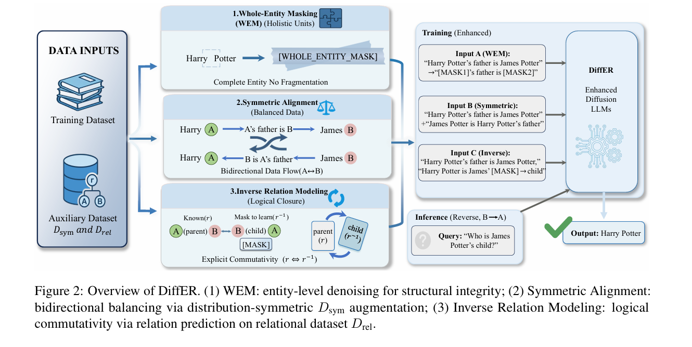

# DiffER: Diffusion Entity-Relation Modeling for Reversal Curse in Diffusion Large Language Models

The source code for **DiffER: Diffusion Entity-Relation Modeling for Reversal Curse in Diffusion Large Language Models**.
# 🔥 News

🎉🎉🎉 **[April. 2026]** We are delighted to announce that our paper, **"DiffER: Diffusion Entity-Relation Modeling for Reversal Curse in Diffusion Large Language Models"**, has been accepted by Findings of ACL 2026!

</h5>

    

## Datasets：
Please download PORE datasets https://github.com/lzc-nazarite/PORE
or unzip data.zip
## Pretrain:
For pre-training, the first step is to extract the origin_prompt from the PORE dataset ar_train_dataset
run 
then bash pretrain.sh
## Pretrainwem:
For pre-training, the first step is to extract the whole entity from origin_prompt then bash pretrainwem.sh
## SFT:
For fine-tuning, the first step is to construct the SFT data paradigm (run .data/sft_data.py), then bash sft.sh
## Inference
For inference, run inference.py
## compare answer:
For comparing answer, run data/ground_truth_data.py to get the correct answer and run compare_answer.py to compare the inference answer and correct answer
## case study
For case study and answer analysis, run analysis_error_answer.py